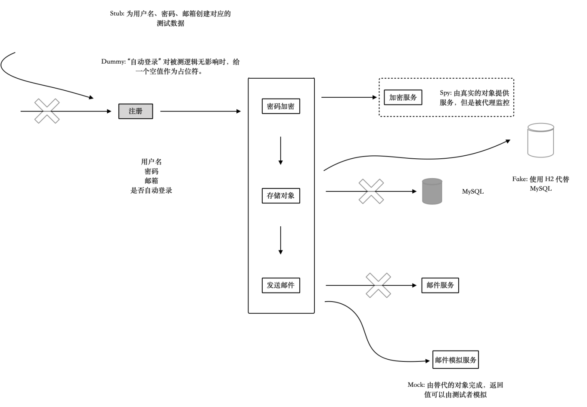
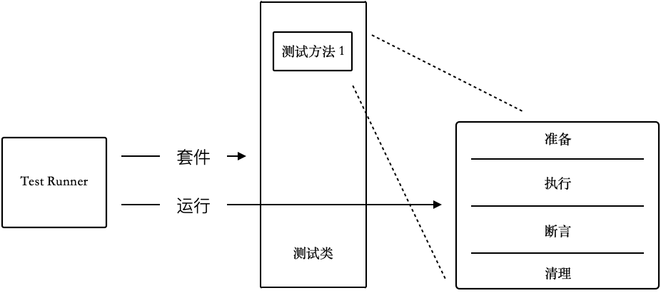

第 4 章 测试替身
================

测试替身是单元测试中非常有用的一个概念，用来隔离组件之间的依赖关系，让不可测试的组件变得可以测试。

曾听很多朋友说，测试替身这个概念非常难理解，它有种浓浓的翻译味。我一直在尝试找一个合适的类比来说明这些概念，直到有一次我家的灯泡坏了，我带着这个灯泡到一家五金店购买新的灯泡。老板在柜子里翻出一个差不多的灯泡，然后插到门后预留的一个灯座上，灯泡亮了起来。我忽然灵光一闪，这不就是测试替身一个绝妙的类比么？代替真实灯座（基础设施）进行验证（单元测试）的装置就是测试替身。

合理运用测试替身可以在运行测试时去除对运行环境的依赖。这也给了我们一个启示，那就是尽可能地使用清晰的边界来设计代码，让编写单元测试更加容易。

编写单元测试有时候不是那么容易。对于前面提到的类比，假如灯泡是通过电线直接连接到供电系统的而不是灯座，那么测试就会变得非常困难。

本章的目标是解决单元测试在实际编写的过程中遇到的各种困难，通过测试替身让单元测试可以顺利进行。在Java技术栈中，我们可以使用Mockito、PowerMock这两种测试替身工具。

本章涵盖的内容有：

-   使用Mockito实现public方法的模拟，用于解决大部分可测性问题。

-   使用PowerMock实现特殊的测试场景。比如在被测试的代码中有一段Sytem.out.
    printf代码，我们很难进行替换，那么就需要使用更特殊的方法。

4.1 测试替身简介
----------------

一个完整的应用程序或者一个系统有时很难提供一个纯粹的类来进行单元测试，对象之间的依赖往往交织在一起，需要拆成各个单元才能逐个击破，这也是单元测试的必要条件。

要将这些交织在一起的对象拆开，需要通过一些工具来模拟相关数据或替换具有某些特定行为的类等。网站[xunitpatterns.com](https://xunitpatterns.com)把这些工具称为Test
Double，翻译过来就是"测试替身"。

在不同的测试图书中对测试替身有不同的说法。比如，在一些图书中将Stubs表述为测试替身，但在有些图书中Stubs被作为测试替身中的一类来看待。

Martin
Fowler为了让这些概念更容易理解，在他的网站  [https://martinfowler.com/bliki/TestDouble.html](https://martinfowler.com/bliki/TestDouble.html) 上重新给出了测试替身的含义，下面主要结合Martin
Fowler
的看法针对测试替身相关概念给出说明。一般情况下，日常交流中会直接使用英文来描述这些概念，为了理解方便，这里也提供相应的中文名称以供参考。

我们将Test
Double作为抽象概念，描述多种测试替身的集合，而测试替身具体的种类使用下面的概念阐述（名词形式）。

-   Dummy ：哑对象（数据）。此对象仅仅用于填充参数列表，实际上不会用到它们，对测试结果也没有任何影响。

-   Fake： 一些假的对象或者组件。它可完整替代依赖组件。例如内存数据库H2，一般只会在测试环境下起作用，不会应用于生产。

-   Stub： 桩件。为被测试对象提供数据，没有任何行为，往往是测试对象依赖关系的上游数据。

-   Spy：间谍对象。它代理了待测对象所依赖的对象，其行为往往由被代理的真实对象提供，代理的目的是了解被依赖对象内部的运行过程。

-   Mock： 模拟对象。用于模拟被测试对象的依赖，它往往是一个具有特定行为的对象。开发者在测试开始前根据期望设置预期返回的结果，被测试对象在调用这个模拟对象的方法时，返回预先设定的值。

在实际开发中，不同的测试框架对这些概念的实现会有一些不同，但大体上不会差太多。例如，在前面我们将Stub理解为给被测试对象提供数据的对象，而在Mockito的源码中，为模拟对象设置预期行为的过程也叫作Stub，动词为Stubbing。测试框架往往会提供与Mock、Spy相关的实现，Stub、Fake、Dummy则需要自己配置或者实现，在本章以及后续的章节中将会聚焦于Mock、Spy的原理和使用上。

注意：为了表述清晰，后文中Mock、Spy 使用中文名称表述。Mock
翻译为中文时，动词为"模拟"，名词为"模拟对象"；Spy
翻译为中文时，动词为"监视"，名词为 "间谍对象"。

图4-1简单说明了这些测试替身分别有什么用，在实际项目中不必全部引入，根据需要使用即可。以用户注册为例，我们编写的单元测试会聚焦于注册部分的代码，至于其他部分，能模拟就尽量想办法模拟。



图 4-1 各种测试替身的解释

下面我们使用 Mockito 来测试依赖关系复杂的对象。

本章的示例代码见 [https://github.com/java-self-testing/java-self-testing-example/tree/master/stubs](https://martinfowler.com/bliki/TestDouble.html)。

4.2 Mockito 
------------

图4-2为Mockito的Logo，画面中包含了一杯莫吉托鸡尾酒，Mockito的名称就是由莫吉托（Mojito）的谐音而来。


图 4-2 Mockito的Logo

Mockito是一个易用的模拟框架，可以通过干净、流式的API编写出容易阅读的测试代码。Mockito和JUnit
4配合得非常完美，在Stack Overflow
社区的投票中排名较高，另外它也是GitHub中引用占比非常高的一个框架。

Mockito最常用的是mock、spy这两个方法，它的大部分工作都可以通过这两个静态方法来完成。使用mock方法输入一个需要模拟的类型后，Mockito会构造一个模拟对象，并提供一系列方法操控所生成的模拟对象。例如，根据参数返回特定的值、抛出异常或验证这个模拟对象中的方法是否被调用，以及通过何种参数调用等。spy方法在使用上与mock方法类似，唯一不同的是它需要传入一个实例化好的对象，Mockito会代理这个方法而不是新建一个模拟类。

选择Mockito的另外一个原因还在于它的生态和可拓展性。后面我们在介绍一些静态方法、私有方法的模拟和测试时，会借助PowerMock来完成，PowerMock和Mockito能很好地协作。

### 4.1.1使用 mock 方法

在下面的示例代码中，stubs模块有一个UserService对象，用来演示用户注册的逻辑。在register方法中，注册的过程分为对密码进行Hash计算、让数据持久化和发送邮件这三个步骤，事实上，实际场景下的注册方法比这更加复杂，这里做了大量简化，以便于我们将注意力集中在单元测试上。

```
public class UserService {
private UserRepository userRepository;
private EmailService emailService;
private EncryptionService encryptionService;

public UserService(UserRepository userRepository, EmailService
emailService, EncryptionService encryptionService) {
this.userRepository = userRepository;
this.emailService = emailService;
this.encryptionService = encryptionService;
}

public void register(User user) {
user.setPassword(encryptionService.sha256(user.getPassword()));

userRepository.saveUser(user);

String emailSubject = "Register Notification";
String emailContent = "Register Account successful! your username is "
+ user.getUsername();
emailService.sendEmail(user.getEmail(), emailSubject, emailContent);
}
}
```

为了演示 Mockito
的基本使用方法，这里没有使用Spring框架，需要读者自己通过构造函数组织对象依赖关系。

我们的测试目标是register方法，与之前的示例不同，这里的被测试方法没有返回值，因此无法根据返回值断言，如果测试过程中没有发生异常就代表功能和逻辑正常。另外，这个方法会调用其他对象，复杂的依赖关系在现实中很常见，示例中已经简化了。

在上述示例中，UserService对象的构造方法需要传人
userRepository、emailService、encryptionService
这三个对象，否则无法工作。

下面演示的是应用了模拟对象的测试示例。首先，创建一个Maven项目或者模块，在Pom文件中增加
Mockito的依赖：

```xml
<dependency>
    <groupId>junit</groupId>
    <artifactId>junit</artifactId>
    <version>4.13</version>
    <scope>test</scope>
</dependency>

<dependency>
    <groupId>org.mockito</groupId>
    <artifactId>mockito-core</artifactId>
    <version>2.28.2</version>
    <scope>test</scope>
</dependency>
```

Mockito使用了Byte
Buddy作为代理技术，根据暴露出来的API可知，只需要传入一个类作为参数就可以生成一个代理对象，并指定这个代理对象的行为以便返回特定的值，从而完成测试工作。

在下面的测试代码中，会使用Mockito 创建我们需要的被依赖对象：

```java

public class UserServiceTest {

@Test
public void should_register() {
// 使用 Mockito 模拟三个对象
UserRepository mockedUserRepository = mock(UserRepository.class);
EmailService mockedEmailService = mock(EmailService.class);
EncryptionService mockedEncryptionService =
mock(EncryptionService.class);
UserService userService = new UserService(mockedUserRepository,
mockedEmailService, mockedEncryptionService);

// Given
User user = new User("admin@test.com", "admin", "xxx");

// When
userService.register(user);

// Then
verify(mockedEmailService).sendEmail(
eq("admin@test.com"),
eq("Register Notification"),
eq("Register Account successful! your username is admin"));
}
}
```

在上述代码中，mock
方法帮我们创建了一个模拟对象，而非真实的对象。mock方法是一个静态方法，来自
Mockito，为了让内容简短，我们一般直接导入静态方法。Mockito
类是Mockito的门面类，提供了大量的静态方法供开发者使用。

上述示例是以Given...When...Then的方式来组织测试代码的，这可让测试看起来更为清晰。Given...When...Then是一种测试的风格，前面在介绍单元测试时已经使用过，由于这里使用了测试替身，这种风格体现得更加明显，下面简单介绍一下。

很多文章认为这种测试用例的风格是行为驱动开发（BDD）的一部分，很多E2E测试框架将其作为默认的代码组织形式，因此被广泛推荐使用。其基本思想是将编写场景（或测试）分解为以下三个部分：

-   Given
    部分描述在开始指定的行为之前程序的状态，可以将其视为测试的前提条件。

-   When 部分触发被测试对象的调用。

-   Then
    部分检查和断言指定行为所产生的变化。这种变化可以是方法调用成功的返回值、抛出的异常、下游的方法被调用等。

Mockito也提供了一个门面类BDDMockito来让开发者使用相关API编写BDD风格的测试。在单元测试中，BDD不是必选项，但我们依然可以模仿与之类似的风格。

按照这个模式，一个测试中应该只包含一组Given...When...Then，如果出现多组，则建议拆分成多个测试。

对register方法来说，想要让测试更有效，就需要验证传给
sendEmail方法的参数是否符合我们的预期。这里可以使用verify方法传入模拟对象，并调用相关方法。verify还可以传入验证的次数，如果是一个循环，被模拟的对象可能会不止一次被调用，不传入的情况下默认是1。示例代码如下：

```java
verify(mockedEmailService).sendEmail(
eq("admin@test.com"),
eq("Register Notification"),
eq("Register Account successful! your username is admin"));

verify(mockedEmailService) 等价于 verify(mockedEmailService, 1)。
```

在上述代码中，verify(mockedEmailService)
等价于verify(mockedEmailService, 1)
。这里还需要验证发送邮件的参数是否是我们所期望的。比如验证发送邮件的地址是否为"admin@test.com"，发送的内容中是否包含了用户名等信息。

上述代码使用了 eq 方法进行对比，需要注意的是，eq 方法和 assertThat
中的equalTo 不太一样。eq 方法是通过对参数进行验证来实现对比的，它来自于
ArgumentMatchers 对象。

我们知道，只有被成功拦截的对象才能用 verify
方法验证。一个形象的例子是，当你去政务中心办理新的身份证时，工作人员会在数个工作日内完成办理，然后通过邮递员派发到指定的收货地址。政务中心的高级检查人员来检查身份证办理的工作是否做到位时，并不需要去监控证件办理人员的一举一动，只需要到下游的环节抽查办理的结果即可。最高明的方法无疑是悄悄扮演成邮递员与办事员对接工作。检查人员就是这里被模拟的对象，那么"方法"被调用的时候，下游的"参数"也就被传递到检查人员手上。

容易联想的是，检查点可以是调用的次数、调用的参数、调用的延时等，而实现的细节和每步的逻辑在verify方法中并不需要检查。反之，包含数十个verify断言方法的测试让编写者和阅读者都感到困惑，它们的职责不够单一，检查点互相覆盖，但又没有充分发挥作用。

### 4.2.2 捕捉参数对象

前面我们验证了邮件发送的内容是否符合我们的预期，但是并没有验证传入userRepository.
saveUser方法的内容是否按照我们的预期执行。因此我们不仅需要验证saveUser方法的调用次数，还需要验证传入的对象。

在 Java
中，如果修改了一个对象的属性值，在进行相等判断时，只会通过引用比较对象。因此，无法起到断言和校验的作用。所以在使用verify方法进行验证时，需要捕捉传人的参数对象，再通过前面介绍的断言来完成验证。

在这种情况下，可以通过ArgumentCaptor构建一个Argument对象，并捕捉参数，再用于断言。示例代码如下：

```
ArgumentCaptor<User> argument = ArgumentCaptor.forClass(User.class);
verify(mockedUserRepository).saveUser(argument.capture());

assertEquals("admin@test.com", argument.getValue().getEmail());
assertEquals("admin", argument.getValue().getUsername());
```

### 4.2.3 设置模拟对象的行为

在register方法中，我们通过encryptionService.sha256方法来对密码进行Hash计算。在单元测试中，我们可以修改模拟对象中方法的行为，从而实现一个完整的单元测试。

在不预设返回值的情况下，调用模拟对象的方法会按照下面的规则返回默认值：

-   如果方法的返回值是一个包装类型，模拟对象会默认返回null。

-   如果是基本类型，会返回相应的默认值，例如数字类型会返回0，布尔类型会返回false。

因此，为了测试各种行为，需要让模拟对象按照我们的意图返回数据或者做一些其他操作。通过when(...).
thenReturn(...)
语句可以修改模拟对象中被模拟的方法被调用时的行为或返回值。

下面的示例中，sha256方法传入了一个any方法，它是参数匹配器，通过匹配一些条件来决定是否修改被模拟方法的行为或返回值。如果any
方法不带参数，则意味着任何参数都满足条件。如果any方法使用any(Class<T>
type)
的形式传入一个参数类型，那么它会限定具体的参数类型。类似地，ArgumentMatchers类中还有eq、contains等方法用于更精确的匹配。

```
when(mockedEncryptionService.sha256(any()))
.thenReturn("cd2eb0837c9b4c962c22d2ff8b5441b7b45805887f051d39bf133b583baf6860");
```

when方法可接收一个模拟对象或间谍对象（后面会讨论）作为参数，随后会调用以下几个方法预置行为。

-   thenReturn：预置一个返回值。

-   thenThrow：抛出一个异常。

-   thenCallRealMethod：调用间谍对象上被代理的原始方法。

-   thenAnswer：返回一个 Answer 对象，Answer
    对象是预置行为的封装类，上面三种都是一种Answer的实现。

仔细观察你会发现，这里赋予一个模拟对象相应行为的操作是通过直接调用这个模拟对象上的方法，并传递一个参数匹配对象来实现的。使用这种语法设置模拟对象的预期行为，就像调用普通方法一样方便，但是容易让人感到困惑。

我第一次使用这个语法的时候感到不可思议，这驱使我去阅读了Mockito的源代码。Mockito在线程的上下文中会记录模拟对象的状态，如果还没有被赋予期望的行为，模拟对象上的方法被调用则会被认为是设置阶段。若存在模拟对象的方法已经被设置了行为，那么它再被调用会返回先前设置的返回值或触发相应逻辑。

这种设计有点像一把特殊设计的枪，第一次扣下扳机时只是为了让子弹上膛，第二次扣下扳机才会发射子弹。

Mockito 还有一些隐藏的规则，若想避免掉入这些陷阱则需要了解一下：

-   可以多次定义预置行为，后续的定义会覆盖前面的设置，以最后一次为准。但是不推荐这种做法，这是一种代码坏味道，引入了一些无效的代码，而且会让可读性下降。

-   一旦预置了行为，无论调用多少次每次调用都会返回相同的内容。

-   Mockito 还提供了其他形式的语法，以便更灵活地给模拟对象设置预期行为。

#### 1. do(...).when(...) 语法

注意，对于没有返回值的方法，不能使用when(...).thenReturn(...)
这种语法设置预期行为，这是因为when方法需要接收一个被模拟方法的返回值作为参数，如果被模拟方法没有返回值，可以使用do(...).when(...)
语法，取得的效果类似。在下面这种情况下，把预置的行为写在前面即可。

```
doThrow(new RuntimeException()).when(mockedList).clear();

// 下面的调用会触发异常抛出
mockedList.clear();
```

相关的一系列方法的说明如下。

-   doReturn：预置一个返回值。

-   doThrow：抛出一个异常。

-   doNothing：什么都不做。

-   doCallRealMethod：调用间谍对象上被代理的原始方法。

-   doAnswer：前面几种方法的封装。

需要特别注意的是，这里的 when
不是接收方法调用后的返回值，而是会接收模拟对象本身，注意区分这两种情况。

#### 2. BDD 风格语法

还记得前面提到的Given..When...Then的测试风格吗？

在Mockito
默认API提供的方法中，when方法被用于定义模拟对象的预置行为，但这样一来就与BDD的风格不一致了，在可读性上会受到一定的影响。

Mockito为了鼓励使用BDD测试风格，也提供了一套API，在这套API里，使用BDD-Mockito类中的方法代替了Mockito类（BDDMock为Mockito的方法别名），可以模仿BDD
的风格进行测试。它的用法很简单，将前面的when修改为given，将then替换为will即可。示例代码如下：

```
given(mockedEncryptionService.sha256(any()))
.willReturn("cd2eb0837c9b4c962c22d2ff8b5441b7b45805887f051d39bf133b583baf6860");
```

在团队达成共识的情况下，利用上述方法别名可以提高测试的自解释性。

### 4.2.4 参数匹配器 {#参数匹配器-1}

参数匹配器是Mockito的一个特色功能，可以让Mock变得更加灵活，用于区分同一个方法多次被不同的参数调用的情况。参数校验器和JUnit中断言的匹配器是类似的模式。

Mockito需要借助参数匹配器来绑定预置行为，参数匹配器也会用于verify方法中，起到断言的作用。

为了暴露 ArgumentMatchers中的 API，Mockito 类直接继承了 ArgumentMatchers
类，这足以说明它的重要性。

前面的例子中使用了any参数匹配器，其用途是让任何参数都可匹配到。如果使用any
参数匹配器，下面的代码执行后会打印true。

```
List mockedList = mock(List.class);
when(mockedList.add(any())).thenReturn(true);

System.out.println(mockedList.add(null));
```

如果想要得到更为细致的类型匹配，可以使用any(Class)、anyxxx等关于类型的参数匹配器。因为没有匹配上，下面的代码会打印出false，这是Mockito默认的行为导致的。

```
List mockedList = mock(List.class);
// 等价于 any(Boolean.class);
when(mockedList.add(anyBoolean())).thenReturn(true);

System.out.println(mockedList.add(null));
```

在上述代码中最容易弄错的是null值的处理，由于字面量（不经过定义而在代码中直接使用的值）、参数匹配器、断言中的匹配器均有多种的写法，开发者非常容易被误导。

使用下面这段代码可以体验不同的匹配方式带来的不同效果。注意，理解在不同情况下对null值的处理方式，可以避免很多未知的问题。

```
List mockedList = mock(List.class);
// 等价 isNull()
when(mockedList.add(eq(null))).thenReturn(false);

// 这里是在真实调用，传入字面量
System.out.println(mockedList.add(null));

// 这里是在验证，仍然使用参数匹配器
verify(mockedList).add(isNull());

// 这里是在断言，使用断言中的匹配器
assertThat(mockedList.get(0), nullValue());
assertThat(mockedList.get(0), equalTo(null));
assertThat(mockedList.get(0), new IsNull());
```

### 4.2.5 使用 spy 方法

如果项目中的对象很多，对所有待测试对象所依赖的对象都进行模拟，工作量会非常大，我们不得不想办法减少相应的工作量。试想，如果对象B依赖A，对象A已经通过了单元测试，那么可以认为A是可信任的。A的结果可以在多数情况下直接用于测试，它并不影响测试的正确性。

要想实现上述设想，可以使用spy方法。spy方法相当于对被测试对象需要依赖的方法进行代理，在不改变原来的逻辑的情况下，对所依赖的对象进行监听，也可以对部分方法设置预期行为。可以说spy方法实现了一种特殊的模拟。其内部实现和mock方法类似，可以看作是局部模拟行为。

由于被spy方法应用的对象往往会有自己的实现，因此可以省去given方法。间谍对象依然可以和模拟对象一样被验证，以及给部分方法预置行为。

例如，对于EncryptionService，我们给sha256方法一个真实的实现：

```
public String sha256(String text) {
MessageDigest md = null;
try {
md = MessageDigest.getInstance("SHA-256");
return new BigInteger(1, md.digest(text.getBytes())).toString(16);
} catch (NoSuchAlgorithmException e) {
e.printStackTrace();
}
return null;
}
```

在register的单元测试中，修改EncryptionService类的mock方法为spy方法，并删除mockedEncryptionService的Given操作。

```
EncryptionService mockedEncryptionService = spy(new
EncryptionService());
```

重新运行测试，可以得到与使用mock方法同样的测试结果。使用spy方法可以大大减少测试样板代码，避免重复工作。使用spy方法就像是一个间谍侵人需要注入的对象观察下游对象的行为，并记录一切，然后在测试完成后汇报他看到的信息一样。

应用了spy方法的对象也可以被验证，在下面的示例中，仍然可以验证register方法确实调用了sha256方法。

```
verify(mockedEncryptionService).sha256(eq("xxx"));
```

### 4.2.6 使用注解

如果每次都编写mock、spy方法来创建模拟对象，代码会显得冗长且不易阅读。利用Java
注解的能力，可以让模拟行为提前自动准备好，在实际工作中，大多数情况下会通过注解完成测试，从而减少测试的代码量。

使用注解只需要修改需要被模拟的三个对象，并使用注解代替手动创建即可：

```
@Mock
UserRepository mockedUserRepository;
@Mock
EmailService mockedEmailService;
@Spy
EncryptionService mockedEncryptionService = new EncryptionService();
```

如果只是加上注解，测试方法并不知道这个测试类需要处理注解并初始化模拟行为，因此需要在测试类上添加一个Runner让Mockito有机会去处理注解。Rumner中的逻辑运行在所有生命周期钩子的最前面，具有最大的灵活性。

我们可在测试类上增加下面的注解：

```
@RunWith(MockitoJUnitRunner.class)
```

到目前为止，想要充分利用Mockito
的特性可以使用MockitoJUnitRunner，还可以通过PowerMockRunner来配合使用PowerMock，通过SpringRumner来配合使用Spring。我们也可以定义一个基类，在基类上使用@RunWith注解修饰，这样就不必在所有的子类中重复定义了。

@Mock注解等价于mock方法，@Spy注解类似，等价于spy方法。拿到模拟对象或间谍对象以后，还需要将模拟出来的对象注入被测试类中才能使用。Mockito提供了@InjectMocks
注解来完成这部分工作。@InjectMocks的注入工作是根据类型来实现的，类似于依赖注人，但如果需要注入一个类的不同实例，注解就无能为力了。

使用注解的完整测试代码如下，也可以在GitHub上的示例代码仓库中找到此代码段。

```

@RunWith(MockitoJUnitRunner.class)
public class UserServiceAnnotationTest {

@Mock
UserRepository mockedUserRepository;
@Mock
EmailService mockedEmailService;
@Spy
EncryptionService mockedEncryptionService = new EncryptionService();

@InjectMocks
UserService userService;

@Test
public void should_register() {
// Given
User user = new User("admin@test.com", "admin", "xxx");

// When
userService.register(user);

// Then
verify(mockedEncryptionService).sha256(eq("xxx"));
verify(mockedEmailService).sendEmail(
eq("admin@test.com"),
eq("Register Notification"),
eq("Register Account successful! your username is admin"));
//
为了验证传入方法的参数是否正确，可以使用参数捕获器ArgumentCaptor来捕获传入方法的参数。
ArgumentCaptor<User> argument = ArgumentCaptor.forClass(User.class);
verify(mockedUserRepository).saveUser(argument.capture());

assertEquals("admin@test.com", argument.getValue().getEmail());
assertEquals("admin", argument.getValue().getUsername());
assertEquals("cd2eb0837c9b4c962c22d2ff8b5441b7b45805887f051d39bf133b583baf6860",
argument.getValue().getPassword());
}
}
```

### 4.2.7 其他技巧

在使用 Mockito
的时候，还有一些技巧可以用来排错，在遇到问题的时候可能会对我们有帮助。

#### 1. 清理模拟状态

如果需要在一个测试方法中反复设置模拟对象的行为，以及重复验证被模拟的方法是否被调用，但是模拟对象上的状态反复变化会干扰测试，那么可以使用reset方法清理掉此状态。

当然，一般情况下不必手动清理模拟状态，测试结束后 Mockito
会自动清理。如果在一些测试场景中，必须使用reset方法手动清理，也请先考虑是否应该将其拆分成多个不同的测试。

#### 2. 获取模拟状态

使用Mockito时，可能会因为错误操作导致模拟不生效，为方便调试，可以打印出模拟对象的信息来探查原因，示例代码如下：

```
EncryptionService mockedEncryptionService =
mock(EncryptionService.class);

given(mockedEncryptionService.sha256(any()))
.willReturn("cd2eb0837c9b4c962c22d2ff8b5441b7b45805887f051d39bf133b583baf6860");

MockingDetails mockingDetails =
Mockito.mockingDetails(mockedEncryptionService);
System.out.println(mockingDetails.isMock());
System.out.println(mockingDetails.getStubbings());
```

执行上述代码即可输出当前对象的模拟状态。通过检查输出的结果，我们可以判断参数匹配是否工作：

```
true
[encryptionService.sha256(<any>); stubbed with: [Returns:
cd2eb0837c9b4c962c22d2ff8b5441b7b45805887f051d39bf133b583baf6860]]
```

#### 3. 使用 Lambda 风格校验参数

使用参数捕获来验证下游对象是否正常工作的代码较为冗长，这时可以使用Matcher来实现Lambda风格的参数校验。原理为参数校验器
argThat
接受一个ArgumentMatcher接口的实例，可以使用匿名的方式实现该接口。这个接口只有一个matches方法，在Java
1.8之后，可以简写为箭头函数，也就是Lambda风格的写法。

校验 mockedEncryptionService 的 sha256方法的，示例代码如下：

```
verify(mockedEncryptionService).sha256(argThat(new
ArgumentMatcher<String>() {
@Override
public boolean matches(String argument) {
return argument.equals("xxx");
}
}));
```

改写成 Lambda 后变得非常简洁：

```
verify(mockedEncryptionService).sha256(argThat(argument -> {
return argument.equals("xxx");
}));
```

甚至可以写成一行：

```
verify(mockedEncryptionService).sha256(argThat(argument ->
argument.equals("xxx")));
```

上面的例子可能过于简单无法说明使用 Lambda
表达式进行断言的方便性，更复杂的例子参考示例代码库中
lambda_verify_object_example 测试示例。

关于 Mockito
实现的详情可以阅读本书的最后一章，进一步了解这些测试框架和库的源码分析过程。

4.3 增强测试：静态、私有方法的处理
----------------------------------

Mockito很强大，能帮我们完成大部分模拟工作，但是对于一些特殊的方法它还是无能为力。

例如，当我们获取系统当前的时间戳时，可能会调用System.currentTimeMillis()，但我们无法模拟这个方法。我们有可能会遇到一些有趣的现象，部分测试过了一段时间后就无法通过了，这是因为在实现中可能有对系统时间戳进行检查的逻辑。再比如财务报销单相关的逻辑，费用产生几个月后再进行报销测试就会失败。这是因为我们在初次测试时，使用的模拟数据是一个固定的时间，因此几个月后重新运行相关的单元测试就无法通过了。

另外，实际项目中不可避免地需要模拟系统中的静态方法、私有方法，以及对一些私有方法进行测试（虽然不推荐测试私有方法），如果遇到的是遗留系统，public方法很大，测试的成本非常高，这时也可以采用技术手段测试私有方法。

配合 Mockito
使用的另外一个框架是PowerMock。PowerMock支持各种模拟框架并对这些框架提供了拓展。powermock-api-mockito是一个拓展库，它通过拓展Mockito并结合PowerMock
功能来做增强测试，解决模拟静态、私有方法的困难，并在必要时测试静态、私有方法。

虽然应尽可能地避免使用PowerMock
这类对封装性破坏较大的库，但是在特殊的场景下还是可以少量使用，它可以快速解决一些不必要的麻烦，具体视情况而定。PowerMock
主要面向有测试经验的开发人员，尽量不要交给初级的开发人员使用。

虽然PowerMock和Mockito都是通过操作字节码来实现模拟功能的，不过两者在实现上有较大的区别，定位也不一样。Mockito是通过对被模拟的类进行字节码处理来实现一个代理类的，用于控制预置的所有逻辑。PowerMock则是对被测试的代码进行处理，通过替换被测试代码的字节码来实现一些高级功能。因此它也额外提供了一些对私有方法、变量访问的功能，可以方便地访问被测试类的内部状态。

这部分的示例代码见 [https://github.com//java-self-testing/java-self-testing-example/tree/master/powermock](https://github.com//java-self-testing/java-self-testing-example/tree/master/powermock) 。

### 4.3.1 模拟静态方法 

为了便于演示模拟静态方法的过程，下面会给前面示例中的User对象增加createAt
字段，createAt字段在register方法内被填充，然后进行持久化。

更新后的User对象如下：

```java
public class User {
private String email;
private String username;
private String password;
private Instant createAt;

public User(String email, String username, String password, Instant
createAt) {
this.email = email;
this.username = username;
this.password = password;
this.createAt = createAt;
}

...
}
```

并给user对象设置对应的值，也就是Instant.now()
方法的返回值，即系统当前的时间。

```java
user.setCreateAt(Instant.now());
```

依据前面的测试可知，这会给测试带来不便，因此需要想办法模拟Instant.now
这个方法，示例代码如下：

```java
assertEquals("", argument.getValue().getCreateAt());
```

首先，引入PowerMock的相关依赖。PowerMock有两个模块，一个是对JUnit的封装，另外一个是对Mockito的封装。它们间接地依赖了JUnit和Mockito，因此可以先把原来的测试依赖移除，再添加这两个依赖。由于
powermock-api-mockito2对Mockito的版本有一定的兼容性要求，所以建议使用下面的方式添加依赖，避免冲突。

```xml
<dependency>
<groupId>org.powermock</groupId>
<artifactId>powermock-module-junit4</artifactId>
<version>2.0.2</version>
<scope>test</scope>
</dependency>
<dependency>
<groupId>org.powermock</groupId>
<artifactId>powermock-api-mockito2</artifactId>
<version>2.0.2</version>
<scope>test</scope>
</dependency>
```

然后，使用PowerMockRunner代替Mockito的Runner，并使用@PrepareForTest对用到该静态方法的地方进行初始化。示例代码如下：

```
@RunWith(PowerMockRunner.class)
@PrepareForTest(UserService.class)
```

如此，在测试过程中，我们就可以模拟Instant类中的静态方法了，并且会影响UserService
中使用它的地方。示例代码如下：

```
Instant moment = Instant.ofEpochSecond(1596494464);

PowerMockito.mockStatic(Instant.class);
PowerMockito.when(Instant.now()).thenReturn(moment);
```

模拟完成后，Instant.now()
就会按照我们期望的值返回结果，测试代码自然也就可以按照预先设定的值来进行断言了。由于PowerMock与Mockito能很好地在一起工作，因此可以继续使用
Mockito 的 API来编写测试。对于特殊的模拟行为，使用 PowerMock
中的语法代替Mockito中的语法即可。完整的测试如下：

```

@RunWith(PowerMockRunner.class)
// 使用 PrepareForTest 让模拟行为在被测试代码中生效
@PrepareForTest({UserService.class})
public class UserServiceAnnotationTest {

@Mock
UserRepository mockedUserRepository;
@Mock
EmailService mockedEmailService;

@Spy
EncryptionService mockedEncryptionService = new EncryptionService();

@InjectMocks
UserService userService;

@Test
public void should_register() {
// 模拟前生成一个 Instant 实例
Instant moment = Instant.ofEpochSecond(1596494464);

// 模拟并设定期望返回值
PowerMockito.mockStatic(Instant.class);
PowerMockito.when(Instant.now()).thenReturn(moment);

// Given
User user = new User("admin@test.com", "admin", "xxx", null);

// When
userService.register(user);

// Then
verify(mockedEmailService).sendEmail(
eq("admin@test.com"),
eq("Register Notification"),
eq("Register Account successful! your username is admin"));

ArgumentCaptor<User> argument = ArgumentCaptor.forClass(User.class);
verify(mockedUserRepository).saveUser(argument.capture());

assertEquals("admin@test.com", argument.getValue().getEmail());
assertEquals("admin", argument.getValue().getUsername());
assertEquals("cd2eb0837c9b4c962c22d2ff8b5441b7b45805887f051d39bf133b583baf6860",
argument.getValue().getPassword());
assertEquals(moment, argument.getValue().getCreateAt());
}
}
```

下面介绍一下使用PowerMock
时需要特别注意的地方，从而避免在实际项目中碰到问题。@PrepareForTest中的参数为一个被处理的目标类，这个类不是被模拟的类，而是被测试的类（业务代码），目的是让被测试代码中的特殊模拟生效。例如，在上面的示例子中，被测试的类是UserService，我们需要模拟的是Instant.now方法，这个方法要在UserService中使用，因此我们需要处理的类是UserService而不是Instant。这是使用PowerMock
的过程中最常见的一个陷阱，原因是静态方法是类级别的方法，需要在被测试类加载前准备完毕。想要特殊模拟在被测试代码中生效，就需要使用@PrepareForTest进行处理。具体的实现是在PowerMockRunner中完成的，其中用了很多字节码级别的技术，想要关心具体实现的读者可以参考源码。

上面的例子中，我们不需要验证Instant.now方法的调用情况。如果在某些情况下需要验证静态方法，可以使用PowerMock的verifyStatic方法重新加载修改后的类，然后进行验证。示例代码如下：

```
PowerMockito.verifyStatic(Static.class);
Static.thirdStaticMethod(Mockito.anyInt());
```

需要注意的是，每次验证都需要调用verifyStatic，因为这两句代码是成对出现的。

### 4.3.2 模拟构造方法

有时候被测试的代码中可能会直接使用new
关键字创建一个对象，这种情况就不太好隔离被创建的对象了。如果不使用PowerMock，甚至这段代码都不能被测试。对此，有两个途径可解决：一是使用工厂方法进行解耦，即用依赖注入代替直接使用new
关键字：另一种方式是使用PowerMock对构造方法进行模拟。

第一种方法相当于修改被测试的代码，在重构时这样做不太安全，因此可以考虑使用第二种方法。在PowerMock中使用whenNew这个方法可以拦截构造方法的调用，直接返回其他对象或者异常。对构造方法进行模拟是PowerMock中最常用的特性之一。

如果在处理一个遗留系统时，在UserService中的register方法中发现了这样一段代码：

```
public void register(User user) {
user.setPassword(encryptionService.sha256(user.getPassword()));
user.setCreateAt(Instant.now());

userRepository.saveUser(user);

sendEmail(user);

// 代码中有一个直接被 new 出来的对象，让这个方法无法被轻易模拟
(new LogService()).log("finished register action");
}
```

那么可以使用whenNew方法传入一个准备好的模拟对象，以此替换原有的实现，从而达到可测试的目的。

```
// Given
User user = new User("admin@test.com", "admin", "xxx", null);

LogService mockedLogService = mock(LogService.class);
whenNew(LogService.class).withNoArguments().thenReturn(mockedLogService);

// When
userService.register(user);

// Then
Mockito.verify(mockedLogService).log(any());

```

使用Mockito准备一个模拟对象，在 new
语句执行时，PowerMock会将这个模拟对象返回，这样后续的断言就可以得到保障，把不可测的代码变成了可测试的代码。

自然地，如果需要验证构造方法是否被调用，可以使用verifyNew(LogService.class).
withNoArguments()。

### 4.3.3 模拟私有方法

与前面的问题类似，在进行重构时，我们发现类中有一些特别长的私有方法，这些私有方法比较复杂，使得测试成本很高。

一种解决方式是通过重构将这些私有方法搬到另外一个类中，使得类的私有方法数量处于较少的状态。另外一种是通过PowerMock对私有方法进行模拟操作。使用PowerMock模拟私有方法非常简单，只需要使用PowerMockito类中的when方法代替Mockito中的同名方法即可。因为直接调用私有方法会出现Java语法报错，所以PowerMockito类中的when方法提供了与Mockito类似的API，但是它的方法名需要以字符串作为额外的参数传人。

假如LogService对象中有一个私有方法
_log用于发送日志到日志平台，由于一些基础设施的原因导致测试失败，那么可以使用PowerMock将其隔离，让其他的测试逻辑正常进行。

下面的示例代码演示了如何使用 PowerMock 模拟私有方法。

```
public class LogService {
public void log(String content) {
_log(content);
}

private void _log(String content) {
System.out.println(content);
}
}
```


下面的代码用于当 _log被调用时不让其有副作用：

```
@RunWith(PowerMockRunner.class)
@PrepareForTest({LogService.class})
public class PrivateTest {
@Test
public void private_test() throws Exception {
LogService logService = mock(LogService.class);
PowerMockito.doNothing().when(logService, "_log", any());

logService.log("test data");
}
}
```

但是需要注意的是，处理私有方法时要处理以下两个对象：被模拟的对象和被测试的对象。在前面的例子中，UserService是被测试的对象，LogService是需要被模拟的对象。如果是LogService中的私有方法需要被隔离掉，@PrepareForTest中的参数则应该设置为LogService而不是Userservice。同理，如果UserService中有一个私有方法，我们想做一些处理，该怎么办呢？首先，需要将@PrepareForTest的参数设置为UserService，其次，由于UserService是被测试对象，无法应用when方法，因此需要使用spy方法包装处理。

### 4.3.4 反射工具箱

如果一个被测试对象有一个私有属性，但是由于某些原因无法赋予模拟对象，导致测试困难，那么可以使用反射方式修改它的可访问性。例如，某Person类上有一个私有属性name，现在需要为其赋予一个新的值，那么可以像下面这样编写代码：

```
Person person = new Person();
Class<?> clazz = Person.class;

Field field = clazz.getDeclaredField("name");
field.setAccessible(true);
// 赋值
field.set(person, "new name");
```

上述代码比较烦琐，Mockito和PowerMock都提供了一组反射工具类，用于访问私有成员，比
Java 本身的反射能力要强一些。

#### 1. 访问私有属性

比如，我们在LogService中增加了一个prefix属性，用于打印日志的前缀，示例代码如下：

```
private String prefix = "warning: ";
...
private void _log(String content) {
System.out.println(prefix + content);
}
```

那么使用Mockito（非PowerMock）的FieldSetter工具类可以直接修改私有属性：

```
LogService logService = new LogService();
FieldSetter.setField(
logService, LogService.class.getDeclaredField("prefix"),
"error: "
);

logService.log("test data");
```

#### 2. 测试私有方法

如果我们遇到某个私有方法时，想要测试它，一种比较好的方法是将私有方法修改为包级别私有，并将测试代码放到同一个包下，但是它处于test目录下（比如，待测试的私有方法位于src/main/java中，测试代码位于src/test/java中），这样测试代码就能访问到该方法了。

另外一种方法是，使用一些辅助工具，例如，使用PowerMock中的Whitebox类等，提供对私有方法、属性的访问。示例代码如下：

```
Whitebox.invokeMethod(testObj, "method1", new Long(10L));
```

大部分情况下建议避免使用反射方式，因为它会大大破坏封装性。不过，在处理遗留系统时，如果因为没有测试保护而不敢贸然修改源代码，且遗留系统中会有很多代码不具备可测试性，那么可以酌情使用这类方法添加一些测试守护重构。

对于新实现的代码，如果出现了需要用到反射才能完成测试的情况，则说明代码中存在坏味道，需要及时处理。

4.4 测试代码的结构模式
----------------------

使用测试替身后，测试代码的结构会变得有些复杂，对于如何良好地组织测试代码的结构，一些专家也总结了几种模式。

### 4.4.1 准备-执行-断言

准备-执行-断言（Arrange-Act-Assert）是一种主流的单元测试代码结构模式，它非常类似
"三段论" 的文章结构：

-   准备：准备测试数据、模拟依赖对象、初始化测试状态（如果有的话）。

-   执行：对测试目标进行调用，执行相关方法和逻辑。

-   断言：验证执行的结果是否满足预期，包括进行断言、对Mock中的下游对象参数进行验证等。

其实从本章的开始，我们就是按照这种结构来介绍单元测试的，每个测试方法基本具有类似的结构。在BDD中，Given...When...Then的语法结构也与之类似。

在敏捷开发中，用户故事可以认为是一个功能特性单位，评价一个用户故事是否完成，可以使用多个验收条件。验收条件可以看作功能测试的测试用例，单元测试只不过是其微观形态。

这种模式非常简单，很容易和团队达成一致，从而写出结构合理、统一的单元测试来。

### 4.4.2 四阶段测试

四阶段测试（Four-Phase
Test）是准备-执行-断言的拓展，该模式描述了创建简洁、可读且结构良好的测试需要具备如下4个阶段。

-   设置：建立测试的先决条件，包括模拟依赖对象、准备测试数据。

-   执行：对系统做一些事情，对测试目标进行调用。

-   验证：检查预期结果，断言和对模拟对象中的下游对象参数进行验证。

-   清理：测试结束后将被测系统恢复到初始状态。

看起来和准备-执行-断言模式类似，对吧？其实只是对它做了一些补充，对测试各部分的职责进行了划分，越来越多的测试框架也在参考这种模式的实现。

在JUnit中，@Beforexxx方法中可以实现一些通用的准备工作，因此可以将其视作设置的一部分。前面提到过另外一个概念Fixture，此概念在很多测试中都能看到，翻译为中文是测试夹具或测试工具类，意思是在设置阶段进行的通用的准备工作（封装为测试Fixture）。

JUnit的@Afterxxx方法对应的是清理工作，大部分情况下可以自动处理。图4-3展示一个测试类（一般也是一个测套件）和多个测试之间的关系。



图 4-3 测试代码的结构

4.5 基于测试替身的反思
----------------------

使用测试替身编写测试，会驱使我们去思考如何设计出更好的业务代码结构。通常情况下，人们容易对他人严苛，对自己宽容，但编写测试的时候是难得的对自己"严苛"的时候。可测试的业务代码一般都具有清晰的层次结构。

### 4.5.1 "大泥球"

"大泥球"是一个用来比喻糟糕的软件设计的术语。一份不经过设计、随意堆砌的代码，没有清晰的结构特征，就像一个泥球一样，毫无结构可言。

所谓的大泥球就是一个随意结构化、蔓延的、不经心的、意大利面条式的代码混合体。系统展现了无可争议的表象：不受管制的增长、重复、权宜之计的修补。信息被系统中相距很远的模块杂乱地共享，重要信息常变为全局的或者重复的。

------ Brian Foote & Joseph Yoder

产生"大泥球"的原因可能有：

-   开发者往往只是关注如何编写代码，而不是关注设计。由于缺乏前期的设计，遇到问题或者新特性时直接进行碎片式的修改，让代码变得混乱和混沌。

-   用户的需求发生变化，但是架构的演进没有跟上，系统变得越来越复杂，维护也变得越来越昂贵。

-   开发者受设计能力的制约。

"大泥球"的代码非常难测试，这些代码往往源自一些遗留系统，需要使用大量的测试替身技巧才能勉强编写出一些测试来保护代码。

为了解决"大泥球"的问题，除了使用面向对象的SOLID原则增强设计和开发以外，还需要注意使用"编排和复用分离"的技巧。有的时候，我们无论让方法分解得多小，都很难绝对地消除重复，或者消除重复的代价是又造成了其他方面的耦合。这时，根据代码的职责进行简单的划分，就可以让其职责变清晰，比如，我们可以将代码分为编排逻辑和复用逻辑。

编排逻辑指的是用于组织原子方法的逻辑，例如用户在注册时会组合调用存储、发送邮件、加密等方法，就可以看作是编排逻辑。编排逻辑关注于场景，而非具体的事情。对于编排逻辑来说，重复优于复用。因为编排本身具有业务含义，如果复用编排逻辑会让这些业务含义混合在一起，那么这种复用并没有带来好处。此外，编排相关的方法彼此之间也不应该互相调用。

复用逻辑指的是可以被多个场景使用的通用逻辑，例如发送邮件时，只需要关注发送邮件这个动作即可，至于发送之后是否需要存储，则交由编排逻辑来处理。

在进行单元测试时，复用逻辑几乎不需要使用测试替身，因为它足够原子化：编排逻辑则需要使用大量的测试替身，好在这其中没有多少逻辑，所以单元测试也还是比较容易实现。另外，E2E测试应该更关注编排逻辑这一部分，如果单元测试处理这部分逻辑的成本过高，也可以交给E2E测试。

### 4.5.2 分层过多

另外一种代码结构也会让测试变得困难，就是分层过多的代码结构。这种代码可能存在过度设计，比如，一个简单的功能由3～4层代码实现。如果根据分层进行单元测试，会造成测试和替身数量远远多于源代码。

分层过多主要是因为设计者没有清晰地认识每个类的职责，他认为分层越多越清晰。实际上，这种做法反而让代码的可读性下降了。因为阅读者往往需要追溯非常多的方法才能找到真正实现业务逻辑的地方。

分层过多的问题如何解决？这取决于设计者对业务逻辑的认知，另外也可以借鉴一些思维方法。通过认识论我们知道，对于现实世界中的一个行为，我们可以基于"主体"和"客体"来进行分析。也就是说，在现实世界中，主体通过操作客体来完成一项任务。而在面向对象中，具有行为的Service通常会操作一些Entity、DTO等具有属性和数据的对象，它们之间也构成了主客关系。

在分层设计中，首先需要弄清楚"主体"类的职责是什么，如果某些"主体"类的职责一致或者类似，则应该考虑合并。

### 4.5.3 滥用测试替身

过多地使用测试替身也会带来问题，比如，封装性会受到破坏，测试代码比业务代码还长很多，在这种情况下，不使用测试替身反而会更加简单和高效。

滥用测试替身会带来如下问题。

-   测试难以理解。过于复杂的模拟行为让测试代码变得极其难以理解，尤其是具有全局状态再配合模拟行为的测试。复杂的测试有可能会让不熟悉代码的开发者花上一整天的时间来修复出现的问题，极大地降低了开发效率。

-   重构成本增加。如果重构的目标代码里包含具有测试替身的测试代码，那么会导致一系列测试需要重新修改。

滥用测试替身往往是为了追求完美的单元测试覆盖率，比如试图让单元测试达到100%，从而想尽办法进行极端的模拟。事实上，在编写测试代码之前，应该先和团队达成一定的共识，优先覆盖最重要的逻辑，为真正需要测试的地方添加单元测试。

4.6 小结
--------

本章介绍了什么是测试替身，以及如何使用测试替身来让单元测试更为简单。在实际工作中，被测试的代码不一定容易被模拟和测试。通过关注前期设计、变更适配需求让代码具有很好的测试性，在实际开发过程中是非常重要的一件事。

当我们确实需要对私有方法进行测试以及行为模拟时，可以使用PowerMock对私有方法进行模拟和验证，并使用反射工具（例如Whitebox、FieldSetter等）来访问私有属性和方法。

当我们的测试变得非常复杂时，团队成员需要就测试代码的组织结构达成契约，这时，可以参考一些测试代码的结构模式。通过遵循同样的编写风格和模式，可以让团队中的代码风格更统一，提高开发效率和体验。

最后介绍了如何通过单元测试来感受源代码的设计质量，以及如何通过测试替身的实现难度来反思代码设计中的一些问题。

我们应该避免使用"大泥球"样的代码结构，在设计代码时，也要注意免去不必要的分层，当然更不能滥用测试替身，以免降低测试的可阅读性和可维护性。
