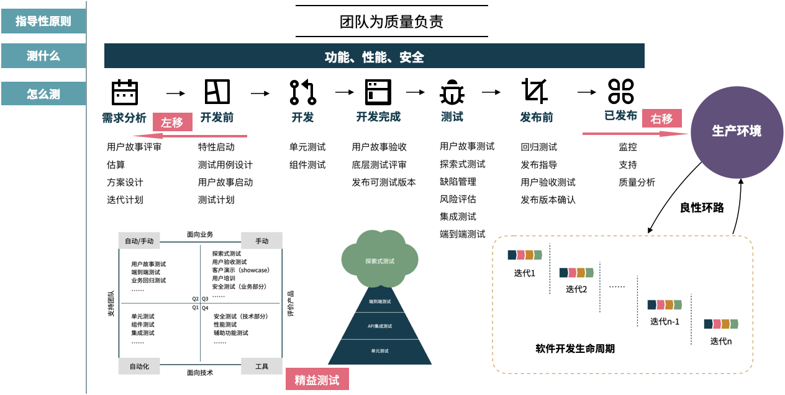
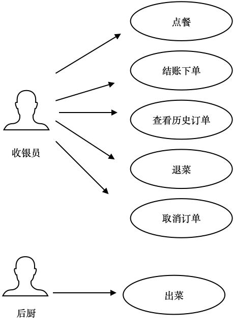
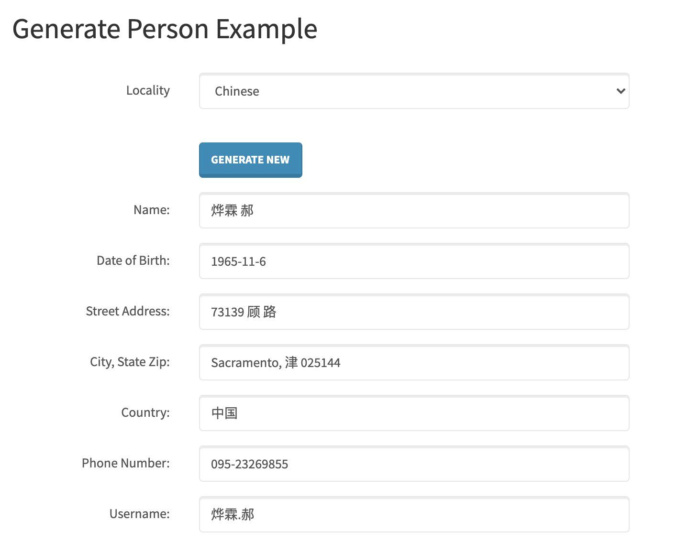

第 1 章 研发自测基础
====================

软件测试是一个非常专业的领域，甚至有一些大学也设置了软件测试课程。虽然大多数软件公司都会设置软件测试类的岗位，但是对于一个优秀的开发人员来说，保证软件质量也应该是份内的事情。

开发人员如果从研发的角度关注测试，那么只需要一丁点投入，就可以换取巨大的价值。因为开发人员熟悉技术方案、编码的细节，甚至所有的分支流程，且了解基本的测试概念，在本地开发过程中就能发现大量的问题，避免反复移交测试等流程，这样就极大地提高了效率。另外，编写出高质量的代码，可以给开发人员带来满足感和信心，避免反复调试。交付高质量的程序后，开发人员也可以更好地集中精力进行下一段程序的开发，避免被打断。

本章会介绍软件测试的一些基本概念和知识，由于本书是面向开发人员组织内容的，因此主要会关注在白盒测试上。

本章涵盖的内容如下：

-   了解软件测试的基本概念。

-   理解常见的测试分类。

-   掌握测试用例设计的一般方法。

-   了解哪些类型的测试适合开发人员自测完成。

-   一些准备测试数据的技巧。

本章的目标是让开发人员对测试的基本概念，以及基本的测试用例设计方法有所了解。

1.1 软件测试的基本概念 
-----------------------

软件测试是一项专业的工作，里面涉及一些专业术语和概念，了解它们可以更好地与质量工程师沟通，本节将精选部分概念进行解释，这些是了解软件测试的基础。

### 1.1.1 软件测试

软件工程中的很多概念来自传统的工程行业，测试（Testing）是一种检验产品质量的活动。因此，通常意义上的"软件测试"被定义为特定环境下检查软件是否存在错误，以及能否满足业务需求和设计目标。

但是软件的含义不仅仅是程序本身，还包括文档、数据和其他基础设施，因此对软件质量的保证并没有局限于程序和代码本身。这也是越来越多的公司将测试工程师（Software
Test Engineer）的岗位转变为质量工程师 （Quality Assurance）的原因。

因为对软件的修改伴随着整个软件生命周期，因此业界开始提倡全流程测试，或者叫全生命周期质量保证。编写单元测试或者特定类型的测试只是软件测试的一小部分。

软件开发过程中，无论是瀑布开发模式还是敏捷开发模式，都会存在需求分析、设计、编码、测试、运行等过程。基于全流程测试的发展，越来越多的测试类型被提出来，比如需求测试、架构测试、设计测试、单元测试、集成测试等。

不仅仅是测试人员需要关注测试结果，整个团队都需要对质量负责。团队工程能力包含了对软件质量的要求，可以参考能力成熟度模型集成的描述。

能力成熟度模型集成（CMMI）是一个组织过程改进框架，CMMI
中的不同等级描述了不同层次的软件开发能力，也就是软件工程成熟度。CMMI
对软件质量提出了要求，这些要求也是很多公司对质量工程师的诉求。

此外，想要保证软件的质量，对软件测试和开发过程的度量也非常重要，除了测试本身之外，还需要利用统计技术对测试的结果进行量化。这种转变，让软件测试从作坊式的定性操作，转变为科学的定量操作。质量的度量指标和方法非常多样，比如测试覆盖率、每千行代码的缺陷率等指标。质量的度量指标可以同比或者环比软件质量的变化。

全过程的测试会对需求、开发、运维的质量进行测试和验证。当对软件的整个生命周期做测试时，就需要合理的分析和规划。这些分析包括软件项目启动时期测试策略的制定，对设计指标的核定，提取需求中的设计指标等。

现代的软件测试提倡测试的工作不在开发完成后开始，也不在运营投产后结束。项目开始时测试人员就需要参与对需求的验证和评审，因此也就衍生出了测试左移的概念，而对运营期质量提出要求，则相应产生了测试右移的概念。

### 1.1.2 缺陷

如果软件没有按照我们的期望运行，我们会说软件有 Bug。Bug
的原意是"臭虫"，这个名称的来源是继电器计算机中飞进的一只飞蛾。

被公认为世界上第一位程序员的葛丽丝 · 霍普女士在 Mark II
计算机上工作时，设备无法正常工作了，整个团队都不知道怎么回事。后来经过排查发现是一只飞蛾飞入设备内部引起的故障（
Mark II是一台继电器计算机，异物的侵入会导致元件无法工作）。葛丽丝 ·
霍普女士在她的笔记中记录了这个故事，说明问题的根因是一个虫子引起的， Bug
这个词也流传了下来。

不过在软件工程领域，更多使用缺陷（Defeat）来描述软件没有按照预期运行的现象。缺陷描述的不仅仅是程序编码上的错误，还包括需求和设计的不合理，运营期间的配置问题，以及基础设施故障等。

在实际工作中，因为缺陷的引入可能会发生在软件开发生命周期的任何一个环节中，因此可以使用正交缺陷分类（Orthogonal
Defect Classification）法划分缺陷，具体如下。

-   需求缺陷：需求本身不合理或者缺乏系统性考虑，造成一致性问题或逻辑矛盾。

-   设计缺陷：设计方案时未考虑到一些场景，或者在设计上不能满足一些特定场景，造成软件在使用过程中出现问题。

-   编码缺陷：由于开发者的疏忽或者其他原因，在编码阶段引入的缺陷。

-   配置缺陷：在投入生产使用的过程中，由于配置不合理或者环境发生变化造成的缺陷，比如更换操作系统后软件无法兼容。

为了更清晰地描述缺陷这个概念，人们区分了以下几个概念。

-   缺陷（Defect）：软件产品中不满足设计需要的部分，它是静态的，一直存在，也就是我们通俗说的
    Bug。

-   错误（Error）：程序执行有缺陷的代码或者输入特定的数据后，造成程序状态异常。

-   失效（Failure）：失效是软件不能正常运行，使用者感知到的状态。一个软件可能有缺陷但是不一定会带来错误并被感知到，失效也有可能是非缺陷造成的，比如运行环境不满足要求等。

需要注意的是，缺陷并不一定会导致程序运行错误，由缺陷导致程序发生错误，叫做缺陷的激活。缺陷往往需要在特定的条件和场景下才会被激活，例如，一些特别的输入或者运行环境发生变化。。

未知条件和场景下的缺陷修复起来非常困难，软件测试的工作就是将能复现这些缺陷的场景找出来，以便于修复。

另外，现在也有很多公司根据优先级和严重性对导致问题的缺陷进行分类。

-   P0
    致命：非常严重的线上事故（比如让整个系统瘫痪），需要停下手上的工作立即修复。如果不能在一定时间内修复，需要上报，通过其他途径来解决（比如使用备用方案）。

-   P1 严重：部分重要功能不可使用，虽然优先级没有 P0
    那么高，但是也需要立即修复并发布补丁。

-   P2
    一般：次要功能不可使用，会给用户带来不便，但是由于需要平衡正常工作节奏，因此不会立即修复，在迭代发布时修复即可。

-   P3 轻微：会给用户带来不便，或者
    UI、文案上存在需要调整的内容。在不影响开发节奏的前提下，进行优化处理即可。

说明：上述分类中的字母 P 是 Priority 的首字母缩写，中文含义是优先级。

### 1.1.3 测试用例

测试用例（Test Case，
TC）是一组测试输入和预期的集合。简单来说就是包含测试内容需要的输入信息、预期及结果，以及特定的测试环境。

在不同的软件开发模型中，测试用例呈现的方式不同。在瀑布模型中，通常会有完善的表格来管理测试用例，并持续维护；使用敏捷的方式，测试用例往往跟随着用户故事（用户故事是一种敏捷需求澄清的方法，包含可验收的最小特性集）；RUP（统一软件开发过程）则要求测试用例可以追溯验证系统行为，采用类似瀑布的方式维护测试用例，但是每个迭代都需要更新，并持续维护。

测试用例的规格在 IEEE
标准和国标（GB/T）上都有被定义过，主要包含如下内容：

-   被测试的对象，对应软件特性或者需求。

-   给予的条件，包括输入信息和测试环境，输入信息包含了测试数据和操作步骤（执行路径）。

-   期望的结果，包含软件的执行预期，相当于程序的输出。

如果能严格和良好地基于测试用例进行实践，可以用较小的成本覆盖大量的测试场景，并能准确地让问题重现。

在一些团队会使用思维导图作为测试用例，但是这种形式比较难以维护。因此，越来越多的公司会创建自己的测试管理平台，思维导图则作为测试用例的补充。

编写好的测试用例，需要遵守如下的原则：

-   测试结果期望可判定。测试用例有明确的判定标准，比如系统登录成功显示
    "登录成功" 文案以及个人信息。

-   测试用例可重复执行。测试用例应该能被反复执行，并且结果保持稳定。

-   测试用例具有代表性。测试用例的设计应该从典型到特殊延展，选取核心业务场景进行测试。

让测试用例具有代表性是设计测试用例的难点，设计者需要从不同的角度选取测试场景，达到最优的测试性价比。有些公司会把正常的流程和符合预期的结果叫做正向用例，把一些异常处理的场景叫做反向用例。

另外最为关键的地方是设计测试数据时，需要考虑到大量的边界值。边界值指的是介于正常数据和错误数据之间的临界数据，比如
0
是正数和整数之间的一个边界值。往往软件开发者难以穷尽用户输入，因此需要借助边界值作为代表性测试数据。

### 1.1.4 测试金字塔

软件测试有很多类型，测试金字塔的核心理念是：不同测试类型的收益和性价比是不一样的。软件测试的不同类型在后面会逐步讲解。

为了取得最优的测试效果，在不同性价比的测试上投入的时间也应不一样的。通常来说，基于界面的测试，自动化难度高，且为了能覆盖更多的的场景，为了让测试能正常运行，需要准备的数据量也更多，相应地投入的时间也会较多。

单元测试则不太一样，需要准备的测试数据量较少，测试的目标更加精确，同时单元测试运行得更快，因此投入的时间较少。

在 《Succeeding with Agile》[^1]
一书中提出了一个测试金字塔，形象地描述了界面测试、服务测试和单元测试的差异。图
1-1
是简单的测试金字塔，可以用来描述不同测试类型的执行速度和消耗资源的情况。

{width="4.472222222222222in"
height="2.5555555555555554in"}

图 1-1 测试金字塔描述了分层测试

实际上测试金字塔中层次的划分取决于所采用的技术栈，并不拘泥于图1-1中所示这三层。在微服务系统中，我们通常使用的测试金字塔可以描述为：单元测试、API
测试、界面测试。

测试金字塔的每一层都可以选用不同的工具来实现自动化，在后面的内容中，会逐步介绍一些自动化测试工具。

测试金字塔只是一种对测试划分方法的模型，这种模型可以有非常多的解释和变种。在一些测试金字塔中我们可能会看到手工测试、验收测试等内容，也可能会有非常多层。测试金字塔主要应用于敏捷过程的测试工作中，在其他的软件开发过程中也不同的测试模型，例如
V 模型。

### 1.1.5 测试策略

从测试金字塔又可以引申出另外一个非常重要的测试概念，那就是测试策略。测试策略描述的是一个项目或者产品如何组织测试活动，以获取最大的价值。

完整的测试策略就是一个项目的完整测试框架，涵盖了关于质量的各方面测试清单，以及对应的实施方式。测试策略可以是一份详尽的文档，也可以是以一个图示或者一份简单的检查清单。

同事林冰玉老师在一次分享中展示了图 1-2
，用于说明测试策略。此图描述了敏捷团队活动中的测试实践，图中左下角使用了一个测试象限，描述哪些测试应该自动进行，中间展示的是一个四层的测试金字塔。测试金字塔中的测试实践为：单元测试、集成测试、E2E自动化测试、探索性测试（也就是普通的手工测试）。

{width="6.197916666666667in"
height="3.1277777777777778in"}

图 1-2 一份简单明了的测试策略

注：图片来源于
https://www.bylinzi.com/2020/01/10/one-page-test-strategy。

测试策略中需要包含如下内容。

-   测试原则：所有的实践都应该围绕这个原则展开，比如"团队为质量负责"。

-   测试范围：功能特性、性能、安全、可用性、可靠性等。

-   测试方法：需求和设计评审、代码静态质量扫描、单元测试、集成测试、E2E测试、安全建模、渗透测试、探索性测试等。

如果将测试策略延展，还可以包括各项软件质量度量的内容等。

### 1.1.6 测试左移和测试右移

这是两个比较新的概念，在传统的软件测试教程中有类似的概念，但是叫法不同。

测试左移是指在软件进入测试阶段之前就介入测试，QA（测试人员）
在设计阶段就参与，并对设计阶段的各项活动进行评估。在需求澄清的时候就应该参与，并对需求、用户故事等输出进行检查。另外，在开发人员进入设计阶段后，也可以对输出的技术方案进行评估，验证技术方案是否能满足设计目标。测试左移还可以提前准备用例和测试环境，调整测试方案以具备更好的测试性。

测试右移是指软件进入发布阶段后也需要 QA 参与，软件发布后 QA
需要持续关注线上预警和监控，及时发现问题，并尝试在测试环境中重现。这样
QA
就可以驱动开发人员在开发过程中考虑接入监控、告警等基础设施，开发团队需要比市场、业务方以及用户更快地发现问题，并制定解决措施。

测试左移和测试右移听起来比较晦涩，简单来说就是 QA
参与敏捷项目的全生命周期。

### 1.1.7 质量度量

在现代软件的开发过程中，度量是一种非常重要的实践。度量可以通过用量化的方法取代定性的结论，来评估软件的质量、过程和测试有效性等，让管理层能做出合理的决策。对于人员配比、能效提升、绩效考核等各个方面都有一定意义。

质量度量的指标研究包含以下几个方面：

-   对于产品的质量进行衡量。

-   对于测试的有效性进行衡量。

-   对于测试的完整性进行衡量。

-   对于测试过程和软件开发过程的分析和改进。

对于普通测试人员和开发人员来说，我们不需要特别去设计这些度量指标，可以根据国际、国内的指标标准提取一些合适自己的指标，作为公司内部使用的度量体系。

ISO/IEC 9126
标准从功能、可靠性、可用性、重用性、效率、可维护性、可移植性这 6
个特性进行度量，和前面对缺陷的理解类似，ISO/IEC 9126
标准将这些指标划分为通用、内部指标、外部指标。内部指标的含义是，侧重在交付前的度量，不关注缺陷被激活的情况，更加关注软件的本质问题。

在国内也有相应的度量体系，GB/T 延用了 ISO/IEC 9126
中的指标，从6个方面对软件质量进行评估。在 《GB/T 32904---2016
软件质量量化评价规范》中，该文档给出了一套根据指标计算软件质量的方法，其中参考使用的标准体系如图
1-3所示。

{width="3.3743055555555554in"
height="3.511111111111111in"}

图 1-3 GB/T 标准体系

对于测试有效性和完整性的衡量可以参考一些主流软件公司的做法，比如某公司会根据千行代码（代码规模一般不作为唯一手段）为基线统计一些测试能力的指标：

-   每千行用例数。

-   每千行缺陷率。

-   用例平均执行时间。

-   缺陷平均回归次数。

-   有效缺陷率（经过确认特性描述不清楚导致的缺陷）。

通过度量后，会根据缺陷的优先级和严重程度进行加权计算，获得每个版本的软件质量指数。

在应用指标的时候，还需要做出区分。由于有一些项目是建立在遗留系统之上的，它的开发过程、逻辑和完全从头开始的项目很不一样。因此我们在使用这些指标的时候，可以根据项目的类型做出取舍。根据软件系统遗留特性可以将项目划分为绿地工程、棕地工程、维护性工程。

-   绿地工程：一项绿地工程可能是在全新的领域中开发，不需要考虑历史遗留问题。绿地工程往往存在需求无法清晰描述特性，有效缺陷率低，缺陷修复的成本低，缺陷回归的效率高等特点。

-   棕地工程：此类工程中的系统通常是现有系统的一部分，或者是其子系统。需要考虑与其他系统（尤其是与历史遗留系统（Legacy
    system））的集成问题。这类项目往往缺陷回归次数高，缺陷的修复成本很大。

-   维护性工程：指的是不再开发新功能的系统，只完成维护性工作。

1.2 软件的测试分类
------------------

不同维度下人们对软件测试的分类极不一致。比如，根据开发过程进行分类，软件的测试类型有：单元测试、集成测试、系统测试和验收测试，这些类型分别和软件开发过程中的各个阶段相适配。但是如果从被测试的对象角度来看，软件测试又可以分为静态测试和动态测试。如果是以测试人员对代码的了解程度来看，则可以分为白盒测试、黑盒测试、灰盒测试。根据是否是自动化运行的测试来区分，又可以分为自动化测试和手工测试。

当然还有一些非常时髦的测试类型，比如契约测试、弹珠测试、冒烟测试等。这些名目繁多的测试，会给团队造成困扰。此外，由于中英文翻译的原因，
像 E2E这类名称没有准确中文含义的测试，更容易让团队成员摸不着头脑。

本书将根据前面提到的测试策略和测试金字塔，并参考 GB/T
的规范，对一个敏捷团队需要进行的测试类型进行简化。为了更加容易理解和记忆，我们将其分为功能性测试和非功能性测试。

正如字面上的理解，功能性测试对应的是功能性的需求，针对软件特性的业务目标和逻辑。非功能性测试，针对的是非功能性的要求。这些要求可能在业务需求上没有做明确的说明，但是不能满足则会给软件交付带来巨大的风险。

（1）功能性测试

-   单元测试。

-   集成测试。

-   系统测试。

-   验收测试。

2.  非功能性测试

-   静态分析。

-   安全测试。

-   性能测试。

就一般的软件而言，一个敏捷团队做好这 7
项测试就能涵盖绝大部分测试需求。实际上，很多公司都没有做到，或者做好这 7
类测试。下面就这 7 类测试进行简单的介绍。

### 1.2.1 单元测试

单元测试（Unit
Testing）是指对软件中最小可测试单元进行测试。"单元"的粒度并没有一个明确的界限，细粒度的单元测试含义一般是对方法、类等代码结构进行测试和验证。粗粒度的单元测试可以是对一个最小的软件特性进行验证，根据设计需求文档或者设计文档进行验证。

单元测试往往处于测试金字塔的最低端。因为单元测试能透明地验证方法、类这一类代码结构，因此编写自动化运行的测试也比较简单。在目前的语义下，单元测试默认有自动化运行的含义。

对软件质量来说，单元测试有非常积极的意义，是测试金字塔中最重要的部分。通过单元测试可以将复杂的测试用例进行拆解，比如从较大规模的测试路径分解成小规模的测试。且单元测试的难度相对较小，测试效率也相应较高。单元测试对环境要求低，隔离性好，为同时运行多个测试用例提供了可能性。

另外，开发人员积极编写单元测试，在遇到问题时可以帮助定位缺陷。

### 1.2.2 集成测试

集成测试（Integration
Testing）是指在单元测试的基础上，对一部分软件模块进行组合或者在组装后进行的测试。在微服务时代，通常来说集成测试是对一个服务的
API 进行测试，因此在很多文章和书籍中都会有 API 测试。但是 API
这个词的含义过于广泛，包括 RESTful API 和操作系统等软件接口的概念。

集成测试需要启动部分或者整个应用的上下文，因此相对单元测试来说，集成测试需要准备的环境更多。在微服务的技术栈下，通常集成测试等同于单个服务的
API 测试。

随着 DevOps
的发展，持续集成的概念得到了广泛关注，集成测试自然也就非常重要了。好的集成测试能保证一个服务部署到测试环境后，不会影响到其他依赖的服务。

在一些大的项目中，服务众多且相互依赖。早期的集成测试大多是手工完成的，会在集成测试时，先进行一个快速地冒烟测试（Smoke
Testing）。冒烟测试来源于早期硬件开发第一次通电验证，检查主要的功能是否正常，避免因为其中一个服务异常而对整套测试环境造成中断。

在 CI/CD 发展比较好的团队，会在服务部署到正式的测试环境前，对 API
进行自动化的测试，如果测试发现问题，会停止部署到测试环境。集成测试的依据是技术设计文档，比如
API 设计等材料。

一般情况下，开发人员也会参与集成测试，或者是在开发人员的配合下由
QA完成集成测试。

### 1.2.3 系统测试

系统测试（System
Testing）是指对完整的软件产品进行端到端的测试，某种程度上可以等同于E2E
测试。

系统测试需要搭建完整的环境，以便在真实或者模拟系统的环境下对软件进行验证，确认是否达到设计目标。需要配置的完整的软硬件环境和基础设施包括数据库、网络连接、DNS等。

系统测试往往是黑盒测试，此测试会模拟正常的用户在使用整个应用程序时的各种操作。系统测试不仅要发现缺陷，还应该提出不限于需求规格范围的反馈，甚至还包括一些使用过程中的便利性问题。

系统测试的依据是需求文档，包括 QA 在需求澄清阶段的任何输入。

### 1.2.4 验收测试

验收测试（Acceptance
Testing）是指在软件开发后期，需求的提出方对软件进行验收确认时进行的测试。

如果是软件交付性质的项目，甲方往往会派出测试专家，从用户的角度进行测试，确认是否满足需求规格。在互联网或者其他产品型的公司，验收测试则是产品上线或者软件发布后，由业务方在真实的环境下进行验证。

对一个在运行中的互联网产品来说，验收测试需要得到特别的授权。因为在生产环境中，一般会产生数据或者留下痕迹，在有条件的情况下可以考虑清理或者隐藏这些信息。

### 1.2.5 静态分析

软件的静态分析（Static
Analysis）是指对软件的各种结构和成分进行扫描，提前发现问题，它通常被作为测试的补充。静态分析一般都是用自动化的工具或者平台在日常进行扫描和监测的。

德国飞机涡轮机的发明者帕布斯·海恩提出的一个在航空界关于飞行安全的法则，法则指出：每一起严重事故的背后，必然有
29 次轻微事故和 300 起未遂先兆以及 1000
起事故隐患。应用于软件开发中，如果项目中代码混乱不堪，必然会在某个时候爆发大量的问题。

静态分析的目的就是通过扫描的手段发现代码中的一些通用问题，或者找出违反编码、安全规范的代码。常见的扫描类型如下。

-   Checkstyle：Java 代码风格扫描。

-   FindBugs：从代码模式上发现潜在问题。

-   ArchUnit：架构规范扫描，验证软件包的组织合理性。

-   OWASP
    Dependency-Track：对依赖的第三方软件和库进行检查，发现是否存在安全风险。

除此之外，市面上还有一些其他的扫描类型，比如：PMD、Fortify
SCA这些都属于静态分析的内容。

### 1.2.6 安全测试

安全测试（Security
Testing）是指对系统的安全要求进行验证的一类测试。安全测试针对的是代码执行、命令执行、病毒植入、端口扫描、DoS攻击、SQL注入攻击、CSRF攻击、XSS攻击、数据遍历、越权、认证绕过、金额篡改等安全问题。

由于互联网项目会将用户信息暴露到公网，近些年来对安全测试的要求又有一定提高，因此数据隐私、威胁建模能也都被包含在安全测试的领域。

-   数据隐私是指软件系统在使用用户的信息时，需要满足当地法律合规的要求，且应尽力保护用户的隐私数据。

-   威胁建模是一种安全测试的方法，通过一些建模工具来分析软件会受到哪些方面的安全威胁，并制定测试策略。STRIDE是常用的威胁模型，它包含欺骗、篡改、否认性、信息泄露、DoS
    威胁、特权提升等 6 个方面，从这些方面可以结构化地制定应对措施。

在一些大的团队中，安全测试往往会由专门的安全专家进行或者给予指导。没有条件的，则由开发人员和
QA 共同完成。

### 1.2.7 性能测试

性能测试（Performance
Testing）是指针对软件性能指标进行的测试。性能测试包括了软件响应速度和用户容量两个方面的内容。

响应速度代表者用户使用软件的等待时间，对于一些常规操作而言，等待时间过长，会极大地影响用户使用。一般对
Web 程序来说，页面的加载时间不超过 2 秒，否则会造成大量的用户流失。

用户容量代表着有多少用户能同时使用该软件。单机软件对用户容量要求不高，对于互联网项目，性能测试需要涵盖容量指标。因此，还有另外一种负载测试，用于通过模拟用户递增的方式找出系统的最大容量，以及验证系统是否能通过增加服务的方式水平扩容。

性能测试工具包括 JMeter、AB、K6 等。JMeter、AB 都是 Apache
基金会的产品，具有良好的使用口碑。K6 是一款新的性能测试工具，能使用
JavaScript 语法编写自动化的性能测试脚本，对 Web 程序相当友好。

1.3 测试用例设计入门
--------------------

一般讲解测试的书籍会将测试分为白盒测试和黑盒测试，然后提供更具体的测试用例设计方法，比如等价划分、因果图法、决策表法、边界值分析等。

但是，对于大部分的开发人员来说都用不到这么多复杂的方法，因此这里只介绍几种常用的，这些方法在后文会逐一用到。

测试用例设计的本质思想是，将原本需要穷举的所有测试数据进行科学的归类、选择、划分，以期用最少的测试数据就可以达到最佳的测试效果。

测试用例设计的遵守的基本思想是 MECE 原则，它是 Mutually Exclusive,
Collectively Exhaustive 的缩写，中文意思是
"相互独立，完全穷尽"。这是一种拆解和分析问题的方法，最开始来自于《金字塔原理》一书，能比较好地指导用例设计的相关实践。

在设计测试用例时，每个用例的执行（无论是人工还是自动化）都有成本，那么需要尽可能的节约。相互独立的意思是拆分的用例没有交叉，完全穷尽是说拆分的问题需要覆盖到所有的情况。比如，把测试数据用户分为男性用户和学生用户，这样就发生了重叠，浪费一次测试的机会。当然，MECE
是一种理想情况，在测试过程中，很难达到这种情况，否则缺陷也就不会存在了。但是，我们可以尽可能地参考这个原则来设计用例，让每个用例都具有高性价比。

### 1.3.1 等价类划分

等价类的划分其实来自于数学的集合论，指的是可以将输入域的集合划分为几个等价子集合，等价类中的元素对于揭露程序中的错误来说是等效的。从划分合理的等价类中取出任意一条数据作为输入条件，均可获得同样的测试效果，这样就可以提高测试效率。

通俗地来说，在同一个等价类中，只要有一条测试数据让软件出错，那么这个等价类中的其他数据往往也会让软件出错。

举一个例子，在一款支付软件中，正确的输入是常规大小的数字，输入其他诸如"&
\* ( "这样的特殊字符，则会给予提示。那么， 10 和 100
就没什么区别，可以将它们视为同一个等价类中。

正是因为正确的输入和错误的输入差异非常明显，所以就形成了天然的划分方式，一般将等价类划分为有效等价类和无效等价类。

有效等价类是指对软件来说合理、有意义的输入数据集合。一般来说，有效的等价类只需要一组即可，在有些情况下可以设计多个，一些团队称之为正向测试（Happy
Pass）。

无效的等价类是指对软件来说不合理、无意义的输入数据集合，相对于有效等价类来说，无效等价类的情况多得多，需要继续划分。无效等价类又被叫做反向测试。

等价类划分有几项固定模式可以参考：

-   如果规定了输入数值的范围，可以设定一个有效等价类，两个无效的等价类。

-   如果规定了输入的数值的规则，可以设定一个符合规则的等价类，两个违法规则的等价类。

-   如果规定了输入的数是一个整数，可以参考的等价类有负数、正整数、负整数和小数等。

-   如果规定输入的是一个字符串，可以参考的等价类有正确的字符串、空、空白字符串和超长的字符串等。

下面来看一个划分等价类，设计测试用例的例子。

支付平台在处理用户输入时，要求用户输入符合要求的金额
X，有如下规则，如果满足规则输入框校验通过，否则提示错误：\
1. 用户只能输入大于 0 小于 2000 的小数。\
2. 金额的最小单位是分。

经过分析，我们可以使用表 1-1 所示的划分类来设计测试用例。

表 1-1 使用等价划分类设计用例

  -------- ------------ ------------------------- ----------
  用例     等价类型     X                         预期
  Case 1   有效等价类   0\<x\<2000,x 是整数       校验通过
  Case 2   有效等价类   0\<x\<2000,x 是两位小数   校验通过
  Case 3   无效等价类   x = 0                     提示错误
  Case 4   无效等价类   x = -1                    提示错误
  Case 5   无效等价类   x=0.001                   提示错误
  Case 6   无效等价类   x=张三                    提示错误
  Case 7   无效等价类   x=\^&\*\^&                提示错误
  Case 8   无效等价类   x=                        提示错误
  -------- ------------ ------------------------- ----------

### 1.3.2 边界值法

边界值分析法（Boundary Value Analysis，BVA）
是一种对等级划分做出有效补充的测试方法。

边界值法是建立在业界共识上的，即软件的错误往往出现在输入输出域的边界上，而不是输入输出域的内部，因此在选择测试数据时，边界值比内部的数据更有价值。

依然使用前面的例子，程序会对用户的输入值进行检查，检查的条件往往都是基于边界值设定的。伪代码如下：

if(input \< 0 \|\| !isANumber(input) \|\| input \> 2000){\
throw new Exception(\"input error\").\
}

通过这段代码可以看出，0、2000
都是一个典型的边界值，数字和非数字字符之间也是一个边界，因为在计算机内部数字和非数字字符的编码值不同。

使用边界值法选择测试数据时，应当选取刚好等于、刚好大于、刚好小于的值作为输入。

边界值分析法有几项固定模式可以参考：

-   如果规定了输入数值的范围，可以选择刚好等于、刚好大于、刚好小于的值。

-   如果规定输入的是一个集合，可以选择空集合、超出最大格式限制的集合、一个元素的集合。

-   使用规则的临界条件。比如，规则
    "输入不为空的字符串"的临界输入是不可见的字符串（空格、制表符等）。

### 1.3.3 场景法

前面介绍的几种测试用例的设计方法都是针对单次操作的，软件往往都需要进行多次操作。因此，我们需要测试组合后的操作，通过组合操作来设计测试用例，即为使用场景法。

软件的流程控制都是通过事件的触发来完成的。单个事件的测试可以用前面介绍的方法来完成，多个事件则需要根据不同的顺序构建不同的事件流，我们将每个事件触发的情景称为场景。

根据事件组合而来的用例，也可以称为复合用例。执行复合用例，可以暴露大量的流程问题，提高测试效果。

如图 1-4所示，场景法一般包含基本流和备选流。

{width="3.236111111111111in"
height="4.527777777777778in"}

图 1-4 用例流示意图

图1-4中的直线表示基本流，是最简单的测试路径，曲线表示备选流，是在某个特定的条件下所发生的异常行为。

备选流可以从基本流的任何节点开始，也可以回退、跳过基本流的节点。

使用场景法的基本操作方法如下：

1）根据业务规则，画出基本流的所有的节点。

2）考虑每一个节点的异常情况，并画出异常节点。

3）根据可达性，这些节点构成一个有向的图。

4）对这个图进行遍历，设计用例。

场景法的注意事项：

-   场景的划分和选择比较重要，软件的场景可能比较多，需要从最重要的场景开始选择。

-   一个场景中可能有多个用户角色，需要特别注意多个角色交替操作的情况。

-   设计场景可以参考开发文档中的用例设计（Use Case）。

下面是使用场景法设计测试用例的案例。

需求说明如下：

这是一款收银机软件，业务设定为服务员也需要让收银员来操作系统，不记座位模式，使用号牌，收银员可以进行选菜、下单、退菜、打单、结账等操作。后厨可以进行出菜操作。

如图 1-5 所示，我们可以根据上述需求来设计用例并进行测试，表 1-2
给出了对应的测试用例。

{width="3.1944444444444446in"
height="4.513888888888889in"}

图 1-5 点餐用例

表 1-2 使用用例流设计用例

+-----------------------------------+-----------------------------------+
| 名称                              | 步骤                              |
+-----------------------------------+-----------------------------------+
| 基本流                            | 1.                                |
|                                   | 收银员开始点餐，启动软件后，能加载菜品列表，并显示详情 |
|                                   |                                   |
|                                   |                                   |
|                                   | 2.                                |
|                                   | 收银员选择菜品，并设定数量、口味等，确认菜品无误后进入下一步 |
|                                   |                                   |
|                                   |                                   |
|                                   | 3.                                |
|                                   | 收银员收到用户费用后，进入下单打印界面，打印小票给后厨，并打印账单 |
|                                   | 给客户，收银员可以在结账后回到点餐状态，为下一次点餐做准备 |
|                                   |                                   |
|                                   |                                   |
|                                   | 4.                                |
|                                   | 后厨看到小票开始做菜，出菜后由后厨确认出菜 |
|                                   |                                   |
|                                   |                                   |
|                                   | 5.                                |
|                                   | 系统接收到确认某个订单的所有出菜信息后，标记订单完成，用于统计和收 |
|                                   | 银员对账                          |
+-----------------------------------+-----------------------------------+
| 备选流 1 - 未结账回退             | 1.                                |
|                                   | 收银员开始点餐，启动软件后，能加载菜品列表，并显示详情 |
|                                   |                                   |
|                                   |                                   |
|                                   | 2.                                |
|                                   | 收银员确认菜品无误后，进入下单打印界面 |
|                                   |                                   |
|                                   |                                   |
|                                   | 3.                                |
|                                   | 收银员可以选择返回上一步，软件记录之前的菜品选择 |
+-----------------------------------+-----------------------------------+
| 备选流 2 - 结账后退菜             | 顾客可能点单后选择退菜，软件允许相应的操作 |
|                                   |                                   |
|                                   |                                   |
|                                   | 1\. 完成基本流的前两个步骤        |
|                                   |                                   |
|                                   | 2.                                |
|                                   | 从历史订单进入，选择退菜操作，只能选择未出菜的菜品项目 |
+-----------------------------------+-----------------------------------+
| 备选流 3 - 结账后取消订单         | 顾客可能点单后选择取消订单，软件允许相应的操作 |
|                                   |                                   |
|                                   |                                   |
|                                   | 1\. 完成基本流的前两个步骤        |
|                                   |                                   |
|                                   | 2.                                |
|                                   | 从历史订单进入，选择取消订单操作，只能选择未发生出菜的订单 |
+-----------------------------------+-----------------------------------+

1.4 研发人员自测范围
--------------------

上面介绍的只是测试工作的部分入门或者基础知识，对于研发人员来说，并不需要关注所有的测试工作任务。

研发人员需要关注一些和研发相关的测试，降低将代码转测（将开发完成的功能提交给
QA
进行测试）后的缺陷率。降低转测后缺陷率的收益是显而易见的。大公司往往都有这方面的要求，并且和部门绩效相关，缺陷率可以直接用于考核。转测失败或者在高测试环境发现问题，非常不利于调试和解决，尽可能地在开发环境中甚至在本地发现和解决可以大大提高开发效率。

不过，哪些质量保证的工作由研发来做，哪些工作由 QA
来做往往争议颇多。最简单的一个法则就是**白盒测试大部分由研发人员完成，黑盒测试大部分由
QA 来完成，由两者一起对最终质量负责。** 图 1-6
给出了一个开发自测的范围，但是最重要的是需要和团队达成共识。

{width="5.647916666666666in"
height="2.660416666666667in"}

图 1-6 开发人员和测试人员的分工

根据测试金字塔的划分方式可知，一般单元测试、集成测试需要研发人员自己完成，并且通常来说，这类测试的自动化测试代码都和业务代码在一个仓库中。这里说说这样划分的考量和经验。

单元测试需要大量依赖模拟（Mock），同时需要分析代码的分支结构才能写出有效的测试用例。此外，这部分测试会引用目标代码，因此它需要和目标代码保持一致的技术栈，而这些只有研发人员自己最熟悉，所以研发人员可以用最高的效率来编写测试。一般来说，合格的研发人员都需要会编写单元测试（这也是一些大厂的必备要求）。

集成测试在前面的定义中是指单个模块、服务的测试，进行集成测试往往需要启动应用上下文，这类测试关注的是单个
API 的能力。一般来说，研发人员用 API
为基本粒度交付特性，这类测试保证对外的 API
能力，同时可以验收单个业务质量。在一些 QA 人员相对充足的情况下，可以让
QA 参与，共同完成。

除此之外，如果把代码规范扫描、安全扫描的结果也算测试的一部分的话，那么同样需要研发人员关注。不过这类工作，一般是公司
QA 部门统一配置、维护的。

一般来说，开发人员的测试工作不仅仅是针对新功能进行测试，持续维护才是最重要的事情，因为随着软件、互联网行业走向发展后期，大部分工作都将是维护和改进。

值得注意的是，开发人员的自测任务往往不只是在新编写软件的时候加入，在重构、修复缺陷、数据迁移的时候也需要及时增加测试，下面详细说明这几个场景。

### 1.4.1 新交付的需求

对于新的需求，一般会让 QA 帮忙提前准备好单元测试和集成测试的用例。

单元测试可以直接使用 JUnit
这类测试框架，通过模拟依赖实现细致的测试用例，尽量覆盖更多的分支。

集成测试可以使用 Spring MockMVC 这类测试框架，通过启动应用来验证 API
的逻辑是否正确。由于集成测试的成本很高，用来编写复杂用例会拖慢开发和测试，因此，测试一个基本流即可。

除了单元测试和集成测试以外，如果熟悉 TDD（测试驱动开发）也可以直接使用
TDD，先编写测试再编写实现，不过 TDD
有一定的学习成本。这些内容的具体操作在后面的内容中会逐步讲解。

测试覆盖率可以将单元测试和集成测试叠加计算，一般集成测试可以快速地跑完一个主要流程，获得大部分的测试覆盖率，然后使用单元测试弥补没有覆盖的分支，进一步获得更高的测试覆盖率。

### 1.4.2 缺陷处理

如果修复了一个
Bug，那么需要及时更新、补充测试，这一点很重要。目的是为了避免同类问题再次出现，或者在其他的场景中出现。另外，修复
Bug
往往会写一些补丁代码，这类代码其他同事很难理解。补充测试后，可以通过测试的语义来描述这这段难以理解的逻辑，和注释相比，测试可以同步更新，若改错了，则无法通过测试。

### 1.4.3 重构

进行重构时，需要先编写单元测试、API
测试或契约测试，保护源代码不受到破坏。重构的含义是，在业务规则不变的情况下，改造或重新设计代码，提高可维护性和代码质量。

因此，重构也是添加测试的重要时机。

### 1.4.4 数据迁移

数据迁移的结果验证是一件比较困难的事情，保证数据迁移的结果正确的方法有两种。

一种是不要手动迁移数据，一定要使用脚本，用一些轻量级的 ETL
工具可以完成这类工作。比如，Spring Batch 可以用 Java
写迁移脚本，而且可以给这类脚本编写单元测试。

其次是编写简单的代码对结果进行校验。即使迁移脚本通过了单元测试，也有可能在运行时因配置错误造成数据错误，因此可以编写一个简单的校验程序，统计迁移前后的数据，或逐行校验。

1.5 测试数据的构造和安全
------------------------

在软件测试的过程中，测试数据的构造看似是一件小事，但是如果能通过高效的方式操作则可以节省大量的时间。有一些团队会直接使用生产环境的真实数据进行测试，实际上这种做法违反了信息安全和合规的要求，需要特别注意。可以使用相关工具来构造测试数据，这些数据是随机生成的，不仅很高效，还避免了安全和合规风险。

### 1.5.1 高效测试数据构造

下面介绍一些工具和技巧来快速、高效地构造测试数据。

#### 1. 通用文本数据构造

可能有读者深有体会，构造测试数据往往能榨干灵感，好在一些常见的测试数据可以通过一些开源工具来实现，比如目前有多种语言的
Faker 库，它使用的是Python、JavaScript 等脚本语言。JavaScript 的 Faker
版本 faker.js 可以部署并运行在浏览器上，进行在线数据生成。如图
1-7所示，faker.js 可以随机生成一些用户信息。

{width="6.194444444444445in"
height="4.884722222222222in"}

图 1-7 随机构造个人数据

在需要的时候也可以将 NPM（Node.js 的包格式） 包放到前端的代码库中使用。

#### 2. 文件构造

有时候需要构造不同大小的文件来完成测试，可是要找到刚好合适的文件大小和
MIME 类型来满足边界值并不是很容易，事实上，这可以通过网站
fakefilegenerator.com 来实现，它可以生成所需类型和大小的文件。

提示：MIME 的全称是 Multipurpose Internet Mail Extensions，
即多用途互联网邮件扩展类型，在文件的头部标明文件的类型，避免依赖文件后缀来识别文件类型。目前常见的文件类型会在
IANA 机构进行注册进行管理。

如果只是想要构造空文件（不介意内容），可以使用命令快速实现，它可以构造任意大小的文件。在
Linux 中， /dev/zero 文件是 0 填充的文件，可以通过 dd
命令复制空白文件来构造新的文件。dd 命令的基本用法如下：

dd if=\<输入文件\> of=\<输出文件\> bs=\<复制块大小\> count=\<复制次数\>

例如，如果需要生成 10 MB 大小的文件，可以使用下面的命令：

dd if=/dev/zero of=ouput.txt bs=1M count=10

在 Linux 中还有一个 truncate
命令，可以将文件任意缩小或拓展到指定的大小：

echo hello \> test.txt\
truncate -s 1024 test.txt

提示：在 Mac OS下要使用 truncate 命令需要单独安装，可以使用 brew install
truncate快速安装该命令。

在 Windows 中就更简单了，Windows 提供了一个 fsutil
命令可以提供指定文件大小的空文件，示例如下：

fsutil file createnew \<输出的文件名\> \<文件大小（字节）\>

#### 3. 图片构造

当我们需要构造一些特定尺寸的图片时，其实不需要在网上到处寻找。有一些图片占位符网站提供了动态生成图片的服务，通过构造图片链接可以获得合适的图片。

例如，在 placeholder.com 网站上，可以构造
URL来生成相应的能满足尺寸、背景、文字等不同需求的图片。如图 1-8 到图
1-11 所示，在 URL 后面设置相关的参数即可构造出想要的图片 。

{width="1.5625in"
height="1.5625in"}

图 1-8 构建正方形图片

注：图片来源 https://via.placeholder.com/150。

{width="2.0833333333333335in"
height="1.0416666666666667in"}

图 1-9 构建矩形图片

注：图片来源 https://via.placeholder.com/200x100。

{width="2.0833333333333335in"
height="1.0416666666666667in"}

图 1-10 修改背景色

注：图片来源 https://via.placeholder.com/200x100/fff。

{width="2.0833333333333335in"
height="1.0416666666666667in"}

图 1-11 增加文字

注：图片来源 https://via.placeholder.com/200x100/fff?text=placeholder。

#### 4. 高效文本操作

如果经常需要批量处理数据时，通过批量的文本操作，可以大大节省我们的时间和缩小工作量。支持批量操作的编辑器非常多，这里以
Sublime 为例，说明批量编辑的方法。

Sublime 可以使用多光标功能批量进行数据操作，很方便，以下面这段文本为例：

逍遥游\
齐物论\
养生主\
人间世\
德充符\
大宗师\
应帝王

如果需要去除换行，并且增加引号将每个词引用起来，然后放到代码的数组中使用，那么在
Sublime 编辑器中，我们可以先全选，再使用 快捷键Ctrl + Shift +
L，获得每行的光标。然后使用 Ctrl +
左导航键移动光标至行首，接下来就可以自由编辑了。

提示：在 Mac OS 系统中，一般 Ctrl 键由 Command 代替。

在 Sublime
中还有一个非常有用的选中功能。如果一个文本中出现了多次重复的字符串，那么可以选中其中一个字符串，然后按下
Ctrl +
D键，这样就可以拓展选中下一个相同的字符串，也就可以快速批量编辑选中的重复字符串了。

和 Ctrl + D 键相似的一组快捷键是 Alt +
F3，选中文本按下快捷键，可以一次性选择文本中出现的所有相同文本，并同时进行编辑。可以使用这种方法快速替换相同的字符串。此外，换行符也可以被选中，可以用于去掉批量换行符。

### 1.5.2 测试数据的安全

由于在测试过程中，数据的管理没有生产环境上那么严格，因此可能存在一定的数据安全风险，尤其是在金融、银行、军工等重要领域，因此我们需要注意对测试数据做一些保护和管理，以及了解一些数据保护相关的法律法规。

#### 1. 信息泄露风险

有一些团队会直接使用生产上的数据作为测试环境数据，实际上这不是非常好的做法，虽然对于一些棘手的缺陷，需要使用生产环境的数据来重现，但是这不应该作为一种常态化的操作方法。生产数据需要和非生产的环境严格隔离，并且需要采取必要的权限管理措施，比如对测试数据进行脱敏。

测试数据脱敏主要有三种方式：删除、置换和漂白。

删除是指将测试数据中的部分或者全部敏感信息去除的处理方式，删除后的数据是原来数据的子集；置换是指将敏感数据进行替换或者掩码处理，使用特殊的符号抹掉部分信息；漂白是指通过特定算法将原来的敏感信息进行加工和处理，虽然数据内容变化了，但是特征未变，还是能作为测试数据使用的（比如随机生成一个新的身份证号码）。

由于数据脱敏具有特殊性，因此很多公司会通过专门的部门来完成。从实现上来看，数据脱敏又可以分为静态脱敏和动态脱敏。静态脱敏是指需要测试数据时才人工地从数据源获取并处理数据；而动态脱敏可以通过脱敏服务进行数据采集，然后经过脱敏算法加工，再分发给使用方。使用方不仅可以用于测试，也可用于业务侧的数据导出、报送审批、存档等流程。

#### 2. 信息数据保护法规

哪些数据属于敏感信息，以及如何管理呢？一般可以参考的信息是相关法律法规，以及行业相关监管部门的要求。

2018年5月25日，欧洲联盟出台《通用数据保护条例》用于欧盟内部的数据管理。《中华人民共和国个人信息保护法》是2021年11月1日通过的我国关于个人信息安全首部法律。《中华人民共和国个人信息保护法》规定了个人信息处理者有义务对个人信息进行分类、加密处理，以及敏感信息的范围。

1.6 小结
--------

本章介绍了测试工作的基础知识、测试的基本概念，以及可以用于团队沟通的基本术语和语言。其中，测试金字塔和测试策略的使用需要在团队中达成一致，让团队为最终的质量负责，才能产出高质量的软件产品。

对于开发人员来说，测试用例的设计不需要用到过于复杂的技巧。在编写单元测试中，往往只需要使用边界值和等价划分方法；在编写
API 测试时，可以适当使用场景的方式。

本章的概念较多，是后续内容的铺垫，从下一章开始将逐步介绍更多实践的内容。

[^1]: Mike Cohn 的经典书籍，中文名称为《Scrum敏捷软件开发》.
    清华大学出版社, 2010.
